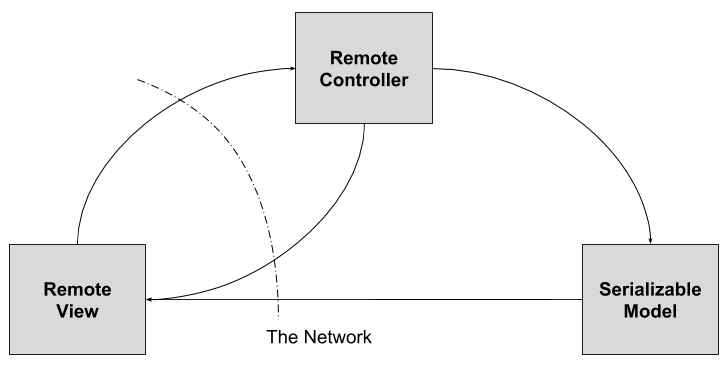

# Lesson 3 - MVC & RMI

Questa cartella contiene esempi su RMI (Remote Method Invocation).

## The Warehouse

Nella cartella `warehouse` è presente un'estensione dell'esempio descritto nelle slides (vedi Beep) che mostra un'implementazione RMI e la possibilità di utilizzare __dynamic class loading__ lato client e lato server.

Il progetto Maven implementa un magazzino remoto che contiene la descrizione di prodotti e prezzi. I clients possono consultare il database dei prodotti e aggiungere nuovi prodotti attraverso chiamate remote.

Questo esempio vuole fornire un'utile strumento per comprendere i meccanismi delle chiamate remote RMI simulando il caso reale in cui l'applicazione RMI sia deployata su macchine differenti e connesse in rete.

A questo scopo sono forniti una serie di scripts:

  + `compile_warehouse_and_move.sh` compila il progetto Maven copiando i `.class` files nelle cartelle in `classloading` per simulare l'utilizzo di diversi file systems: `client` e `server` contengono le classi del
  client e del server rispettivamente, `common` è disponibile per entrambi.

  Questa la struttura desiderata della cartella `classloading`.
  ```
    .
    ├── client
    │   ├── Client.class
    │   ├── ClientDummy.class
    │   └── MusicCD.class
    ├── common
    │   ├── Product.class
    │   └── Warehouse.class
    └── server
        ├── Book.class
        ├── Server.class
        └── WarehouseImpl.class
  ```

  + `launch_nanohttpd.sh` lancia un webserver raggiungibile all'indirizzo `localhost:8080` e che contiene l'intera codebase.
  + `launch_registry.sh` lancia il registry RMI.
  + `launch_server.sh` lancia il server aggiungendo `common` e `server`
  nel suo classpath. Se lanciato con parametro `0` setta la codebase con riferimento al proprio file system (ok in testing environment, stessa macchina).
  Se lanciato con `1` setta come codebase l'instanza nanohttpd.
  + `launch_client_dummy.sh` lancia un dummy client aggiungendo solo `client`
  nel classpath. Questo caso effettua unicamente il `lookup` dell'oggetto remoto per mostrare il meccanismo di download dello stub.
  + `launch_client_0.sh` lancia il client aggiungendo `common` e `client`
  nel classpath. In questo caso l'interfaccia `Warehouse` è già presente nel client per necessità di compilazione e per questo motivo non risulta l'accesso alla codebase indicata dal server (client RMI controlla prima in locale). Questo caso mostra inoltre come l'RMI client possa ottenere un file `.class` a runtime (in questo caso `Book.class`) che non sia presente nel suo classpath e filesystem utilizzando [dynamic
class loading](https://docs.oracle.com/javase/8/docs/technotes/guides/rmi/codebase.html) dalla codebase indicata dal server.
  + `launch_client_1.sh` lancia il client aggiungendo `common` e `client`
  nel classpath e settando la codebase property. Se lanciato con parametro `0` setta la codebase con riferimento al proprio file system (ok in testing environment, stessa macchina). Se lanciato con `1` setta come codebase l'instanza nanohttpd. Questo caso mostra come anche l'RMI server possa ottenere un file `.class` a runtime (in questo caso `MusicCD.class`) che non sia presente nel suo classpath e filesystem utilizzando [dynamic
class loading](https://docs.oracle.com/javase/8/docs/technotes/guides/rmi/codebase.html) dalla codebase indicata dal client.

Il file `warehouse.png` fornisce un diagramma che descrive le classi principali del progetto (_disclaimer_: il file non è conforme alla notazione UML, i packages sono usati per rappresentare il deployment simulato, le classi relative ad RMI sono mostrate per rappresentare il meccanismo di RMI ma non appartengono al source code).

## RMItter (RMI Twitter)

La cartella `rmitter` contiene un'implementazione semplificata di Twitter basata sull'utilizzo di RMI.
I requisiti della nostra implementazione sono:
  + Utenti possono creare post
  + Gli utenti sono identificati dal loro username
  + I post possono contenere hashtags (iniziano con #) e mentions di altri utenti (@username)
  + Gli utenti possono _seguire_ altri utenti e devono essere notificati sui loro nuovi post
  + Gli uteni possono _seguire_ hashtags e devono essere notificati su ogni post che contenga lo specifico hashtag seguito
  + Implementazione Client-Server, client associato ad un singolo utente con un'interfaccia testuale

L'implementazione segue il pattern MVC separando la View nel lato-client dal Model e Controller nel lato-server. Si noti che:

  + Il Model contiene solo `Serializable` objects (e.g. User) che sono forniti alla View negli updates. Gli oggetti sono serializzati e non remoti, quindi possono solo essere querati e ogni modifica applicata ad essi non ha effetto lato-server. 
  + Il Controller è esposto come oggetto remoto e mappa le chiamate RMI della view a chiamate locali sul modello. 
  + La View è observer remoto del modello (permette chiamate remote, ma non è esposto sul registry e _si passa_ al controller al momento del login).

L'immagine sottostante rappresenta l'architettura di `rmitter`:



Nella cartella `rmitter` sono presenti gli UML diagrams del Model e quello dell'intero progetto.

Si noti che:
  + il registry RMI è lanciato all'interno del programma Server
  + Client e Server utilizzano entrambi la stessa codebase locale
  + l'implementazione è molto semplice se comparata a quella vista nell'`es2` per l'esempio `socket`, grazie al networking layer offerto da RMI.

#### TODO
Per comprendere meglio l'esempio si può provare ad estendere il progetto abilitando lo storage dei posts lato server e aggiungendo la possibilità per un utente di chiedere la `history` dei suoi ultimi `n` posts (comando da CLI `:history n`).
